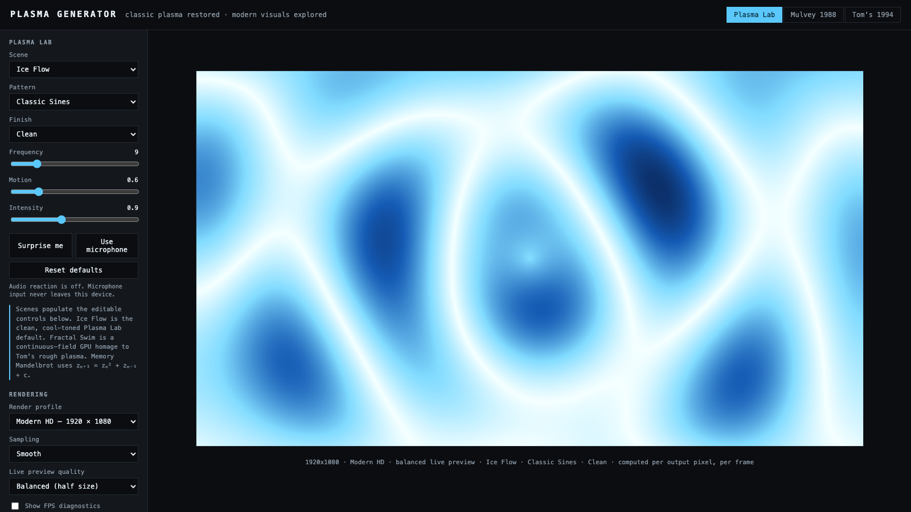
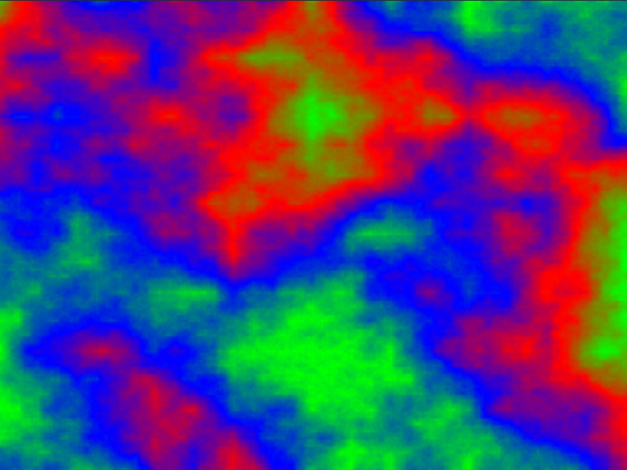
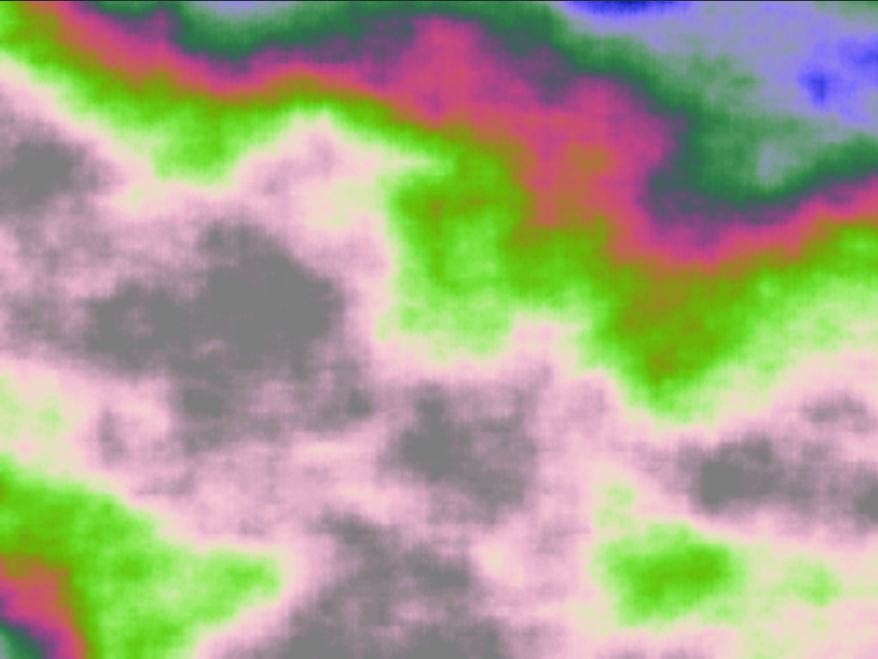

# Plasma Generator

A browser-native generator that restores two memorable DOS plasma effects—Bret Mulvey's **PLASMA** (1988) and Tom Dibble's **Tom's Plasma 1.1** (1994)—alongside a new, GPU-native collection of generative visuals called **Plasma Lab**.

**▶ Live demo: <https://plasma.lab.eric-blue.com/>** — no install, runs entirely in the browser.



The historical modes aim to preserve what made the originals distinctive. The modern mode builds outward with liquid, vortex, kaleidoscope, and mandala fields; artist-inspired and editable palettes; bloom and trail finishes; HD/UHD rendering; seamless loops; and recording.

## Why did I do this?

I was hunting for a couple of programs I remembered running in the early-to-mid 1990s. I found the `.exe` files and, to my surprise, discovered that source code for both projects had survived with them.

That turned into an experiment: how faithfully could these small DOS-era effects be understood and modernized with the help of both Anthropic Claude and OpenAI Codex? It was never meant to become a product or replace the originals. It was a fun way to revisit a formative corner of computing, test what current development tools could do with old code, and learn exactly how the effects worked.

I wanted to share the result so other people could enjoy the original programs as natively as possible in an easily accessible format—no DOS setup required—and so there would be room to experiment with a new plasma generator incorporating some new twists and visuals of its own.

## Highlights

- Mulvey's palette-cycled diamond-square plasma, generated in the browser or displayed from the surviving 1988 image artifact.
- Tom Dibble's fractal generator, animated palettes, and two-window “swimming” compositor, with exact VGA and native widescreen paths.
- Nine Plasma Lab patterns spanning plasma, symmetry, and fractals; three finishes; curated scene presets; custom palette editing, and seeded Surprise Me.
- Authentic 320×200, HD 1920×1080, and UHD 3840×2160 profiles.
- PNG and WebM output, loop-aware Plasma Lab recording, share links, and portable JSON presets.
- Fullscreen and distraction-free presentation modes, preview-quality controls, one-click defaults, reduced-motion behavior, FPS diagnostics, and offline/PWA support.

## Restored DOS renderings

| Mulvey PLASMA (generated field, 1988 palette) | Tom's Plasma (full field, swim window off) |
|:---:|:---:|
|  |  |

## Run locally

The [live demo](https://plasma.lab.eric-blue.com/) needs nothing installed. To run
your own copy:

Requirements: Node.js 20 or later and Yarn 1.x.

```bash
cd web
yarn install
yarn dev
```

Then open the URL printed by Vite. A production build is equally small:

```bash
yarn build
yarn preview
```

See [web/README.md](web/README.md) for engine details, controls, and fidelity notes.

## Tests

```bash
cd web
yarn build
yarn test:generator
yarn test:visual
```

The first suite locks down canonical artifacts, deterministic fields, Tom's movement/compositor behavior, and palettes. The Playwright suite compares stable canvas screenshots. Install its Chromium build with `npx playwright install chromium` when a system Chromium is not available.

## Historical material and credits

The original archives, executable files, and source trees are research inputs, not part of the public repository. They are excluded by `.gitignore`; local copies are not deleted.

The modern ports would not exist without:

- **Bret Mulvey**, author of PLASMA (1988).
- **Tom Dibble**, author of Tom's Plasma 1.1 (1994), who explicitly permitted reuse provided he was credited and derived code retained the same freedoms.
- **Jeremy Longley** (JCL-Plasm) and **Thomas Hagen**, whom Tom credited in the historical lineage of the “swimming” effect.

Claude and Codex were used as development and analysis tools during the modernization experiment. Technical and licensing details are in [THIRD_PARTY_NOTICES.md](THIRD_PARTY_NOTICES.md).

## License and release status

New, original project code and documentation are offered under the [MIT License](LICENSE). That license does not replace third-party copyrights or permissions described in [THIRD_PARTY_NOTICES.md](THIRD_PARTY_NOTICES.md).

Tom Dibble's archive contains an explicit reuse grant. Bret Mulvey's surviving documentation states copyright but no redistribution or derivative-work permission has been located. **Do not publish a release containing the Mulvey-derived implementation or `plasma-1988.img` until that permission is confirmed, or those portions have been removed/replaced following legal review.** The concrete gate is documented in [RELEASE_CHECKLIST.md](RELEASE_CHECKLIST.md).

Contributions are welcome; see [CONTRIBUTING.md](CONTRIBUTING.md). Please report security issues according to [SECURITY.md](SECURITY.md).
